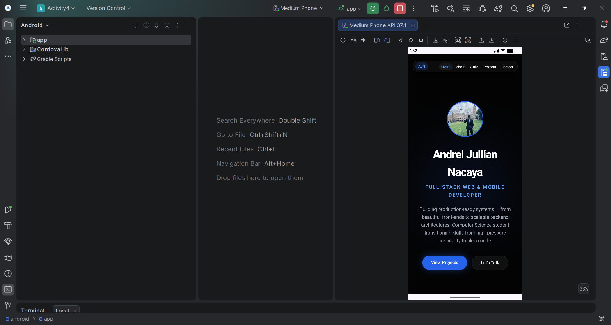
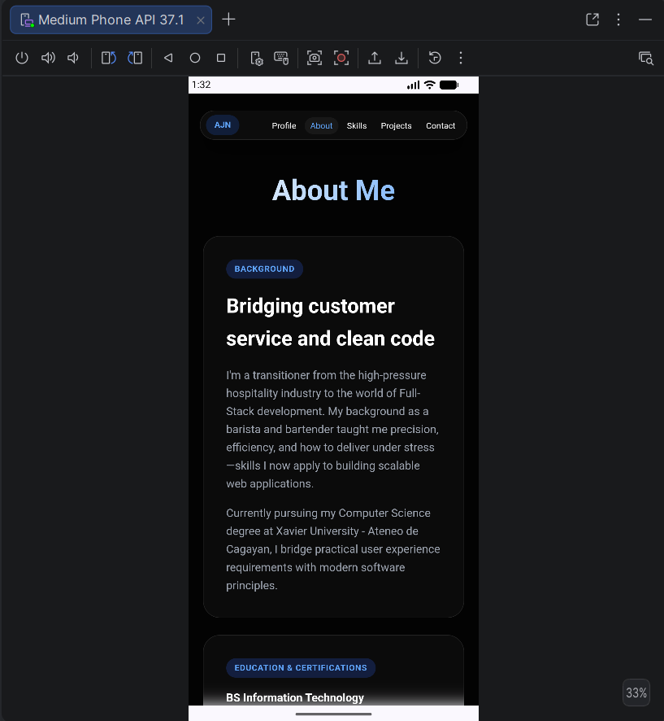
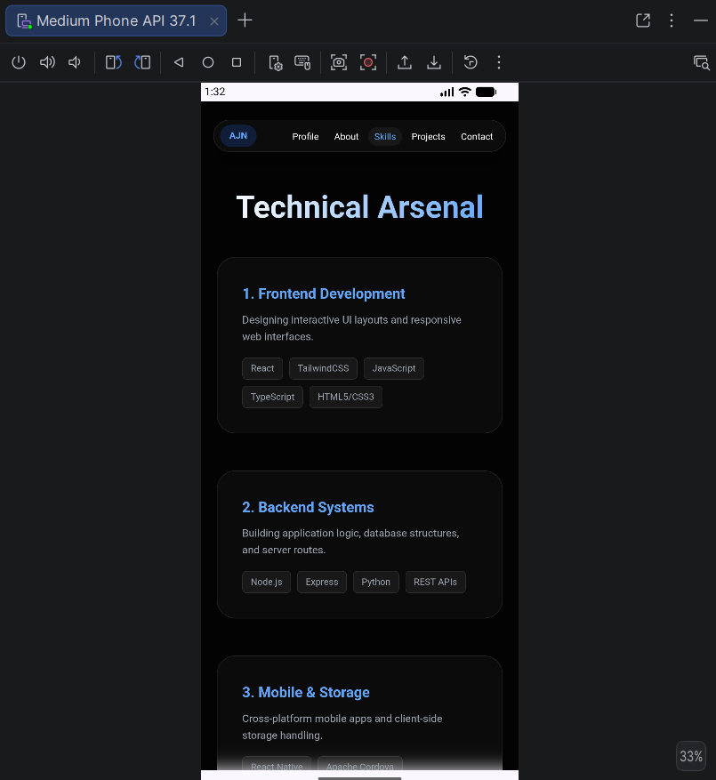
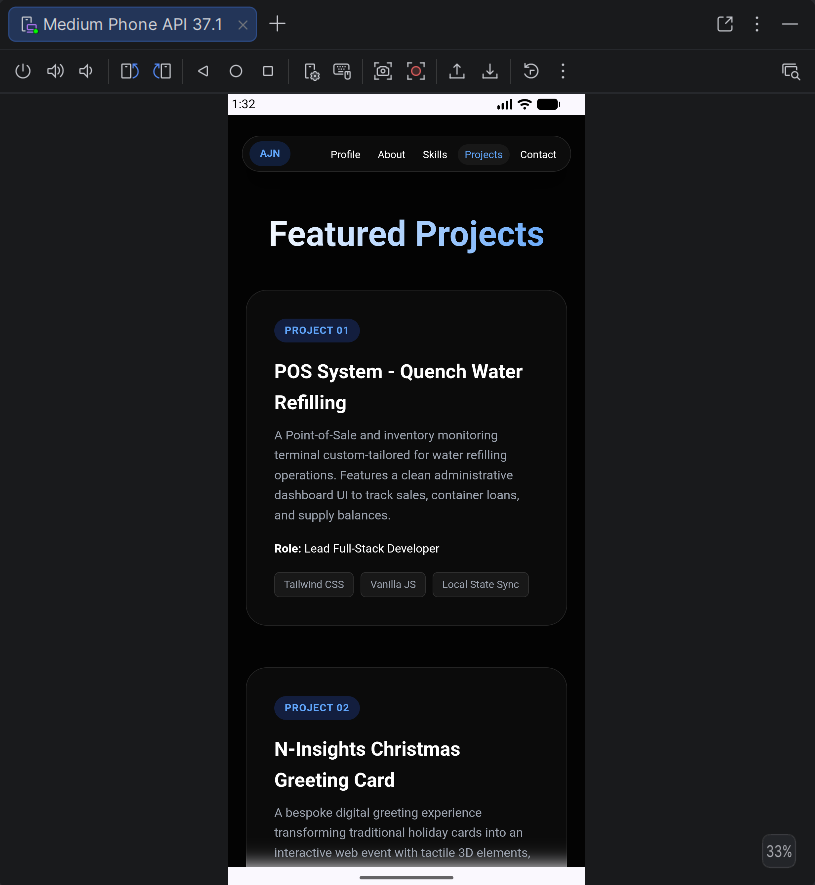
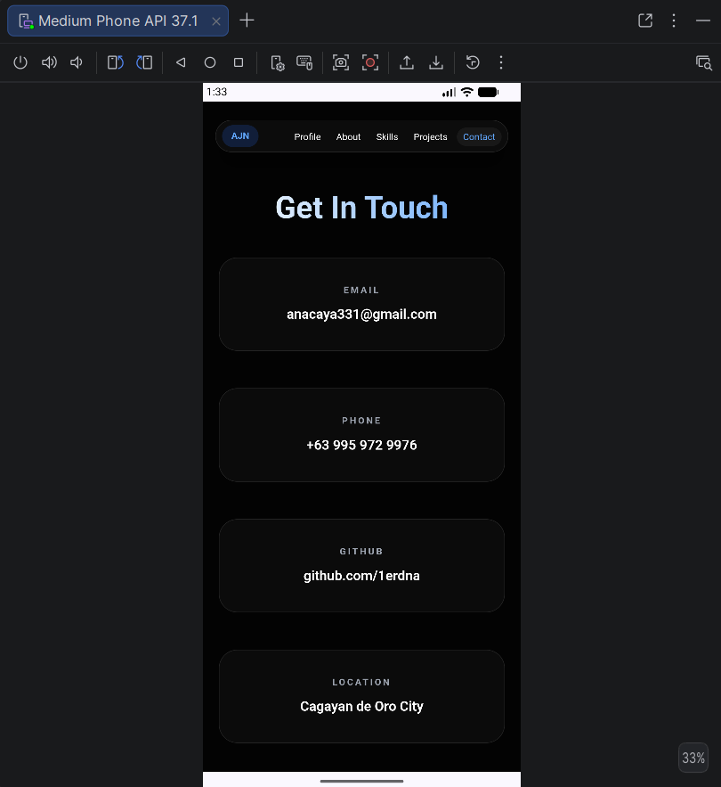
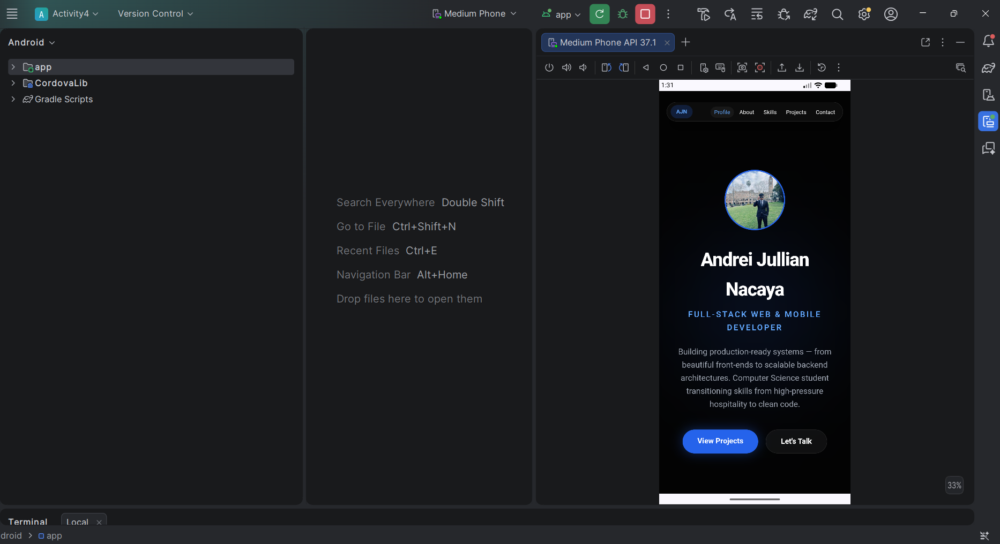

# Nacaya Student Profile — Activity 7

A responsive Apache Cordova student-profile application with a Node.js/Express API, JWT authentication, MySQL database integration, editable profile data, and Cordova camera support for changing the profile picture.

**Student:** Andrei Jullian Nacaya  
**Package ID:** `com.student.profile`

## Features

- Secure login using username/email and a bcrypt-hashed password
- JWT-protected profile and test-record API routes
- MySQL-backed student profile
- Edit and save Full Name, Course, Year Level, About Me, and Skills
- Change Profile Picture using `cordova-plugin-camera`
- Persist the captured profile picture in MySQL
- Create, retrieve, and delete authenticated test records
- Responsive Profile, About, Skills, Projects, and Contact pages
- Android Emulator support using `10.0.2.2` for the local backend

## Screenshots

| Profile | About | Skills |
| --- | --- | --- |
|  |  |  |

| Projects | Contact | Android Studio |
| --- | --- | --- |
|  |  |  |

## Technology Stack

### Mobile / Frontend
- HTML5
- CSS3
- Vanilla JavaScript
- Apache Cordova
- `cordova-android` 15.1.0
- `cordova-plugin-camera` 8.0.0

### Backend
- Node.js
- Express
- `mysql2`
- `bcryptjs`
- `jsonwebtoken`
- `cors`
- `dotenv`

### Database
- MySQL 8.x

## Project Structure

```text
Nacaya_StudentProfile/
├── config.xml
├── package.json
├── www/
│   ├── index.html
│   ├── login.html
│   ├── about.html
│   ├── skills.html
│   ├── projects.html
│   ├── contact.html
│   ├── css/style.css
│   ├── js/index.js
│   ├── js/login.js
│   └── img/
└── backend/
    ├── .env.example
    ├── schema.sql
    ├── db.js
    ├── seed.js
    ├── server.js
    ├── middleware/authMiddleware.js
    └── routes/
        ├── auth.js
        ├── profile.js
        └── records.js
```

`platforms/`, `plugins/`, `node_modules/`, IDE files, build outputs, and `.env` are intentionally excluded from Git.

## Prerequisites

- Node.js and npm
- Apache Cordova CLI
- Android Studio + Android SDK
- Java/JDK supported by your Cordova/Android setup
- MySQL 8.x

## 1. Install Project Dependencies

From the project root:

```bash
npm install
```

Install backend dependencies:

```bash
cd backend
npm install
```

## 2. Create the MySQL Database

Open MySQL Workbench and run:

```text
backend/schema.sql
```

The schema creates:

- `users`
- `student_profiles`
- `profile_test_records`

The `profile_image` column uses `MEDIUMTEXT` so the application can store the Base64 profile picture returned by Cordova Camera.

If your Activity 7 database already exists from an earlier version, run `backend/migrate.sql` once so `profile_image` is upgraded to `MEDIUMTEXT`.

## 3. Configure the Backend

Copy:

```text
backend/.env.example
```

to:

```text
backend/.env
```

Then enter your local MySQL credentials and a private JWT secret.

Example variable names:

```env
PORT=3000
DB_HOST=localhost
DB_PORT=3306
DB_USER=root
DB_PASSWORD=YOUR_MYSQL_PASSWORD
DB_NAME=nacaya_student_profile
JWT_SECRET=replace_with_a_long_random_secret
```

Do **not** commit `backend/.env` to GitHub.

## 4. Seed the Test Student

From `backend/`:

```bash
npm run seed
```

Default seeded login:

```text
Username: andrei
Password: andrei123
```

If the user already exists, the seed script does not create a duplicate account.

## 5. Start the Backend

From `backend/`:

```bash
npm start
```

Expected address:

```text
http://localhost:3000
```

The Android Emulator must **not** use `localhost` for this backend. The frontend uses:

```text
http://10.0.2.2:3000
```

which maps the emulator to the host computer's localhost.

## 6. Prepare Android

Return to the project root:

```bash
cordova prepare android
```

If the Android platform has not yet been added:

```bash
cordova platform add android
cordova prepare android
```

The camera plugin is declared in `package.json`. If it needs to be restored manually:

```bash
cordova plugin add cordova-plugin-camera
```

## 7. Run in Android Studio

Open:

```text
platforms/android
```

in Android Studio.

Then:

1. Start an Android emulator.
2. Keep the Node.js backend running.
3. Run the `app` configuration.
4. Log in using the test credentials.
5. Open the Profile page.
6. Test **Edit Profile** and **Change Profile Picture**.

## Camera Flow

The application waits for the page/Cordova lifecycle and safely binds the camera button once.

When **Change Profile Picture** is tapped:

1. `navigator.camera.getPicture()` opens the Android camera.
2. The camera returns JPEG Base64 data through a normal JavaScript callback.
3. The image is displayed immediately.
4. The profile image is submitted to `PUT /api/profile`.
5. MySQL persists the image in `student_profiles.profile_image`.

The camera success callback is intentionally a normal function instead of an `async function`, because Cordova's runtime argument checker expects a standard `Function` callback. The asynchronous database save is started separately.

## API Endpoints

| Method | Endpoint | Purpose |
| --- | --- | --- |
| GET | `/` | API status |
| GET | `/api/health` | Health check |
| POST | `/api/auth/login` | Authenticate student |
| GET | `/api/profile` | Retrieve authenticated profile |
| PUT | `/api/profile` | Update authenticated profile |
| POST | `/api/records` | Create test record |
| GET | `/api/records` | Retrieve test records |
| DELETE | `/api/records/:recordId` | Delete owned test record |

Protected endpoints require:

```text
Authorization: Bearer <JWT_TOKEN>
```

## Validation / Code Checks

Frontend syntax:

```bash
npm run check
```

Backend syntax:

```bash
cd backend
npm run check
```

## GitHub Notes

Before committing:

```bash
git status
git diff
```

Recommended Activity 7 commit:

```bash
git add .
git commit -m "Complete Activity 7 authentication and database integration"
git push
```

Never commit `.env`, database passwords, JWT secrets, `node_modules`, generated Android build files, APKs, or local IDE files.

## Previous Activity 6 Camera Screenshots

The repository also contains camera-integration screenshots under:

```text
www/img/activity6/
```

These document the earlier camera activity and can be retained as supporting submission evidence.
